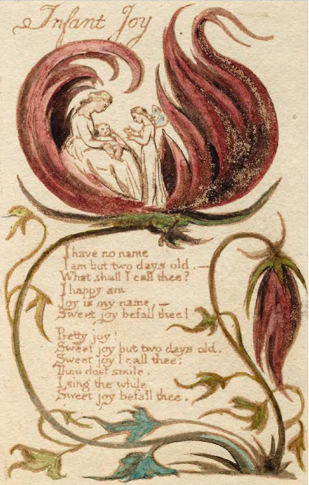
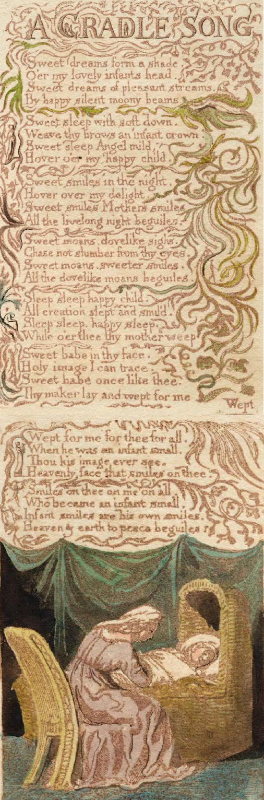

# Helló, világ!

Így kezdődik minden informatikai útmutató, és így kezdődik az első weblapod is, Dini! <3

A lap, mely egyben első karácsonyi ajándékod is (meg persze a szüleidé), két fő részből áll, melyekre a következő linkekre kattintva oda is ugorhatsz:

1. Mivel egy napon születtél a történelem egyik legnagyobb zsenijével, William Blake-kel, így nagybátyád készült neked két kis versfordítással _Az ártatlanság dalai (Songs of Innocence, 1789)_ című csodaszép ciklusból, melyeket [itt](#blake) találsz meg. (Ha kicsit nagyobb leszel és lesz kedved, vesd majd össze Weöres Sándor fordításával!)

2. Ami még ennél is sokkal izgalmasabb: Kecskés Péter, aki kissé fura figura ugyan, de kétségkívül az ország leginspiráltabb asztrológusa, készített neked egy asztrológiai elemzést, melyet [itt](#asztro) hallgathatsz meg! (Vagyis talán egyelőre, első körben a szüleid! :) (Kedves szülők, vigyázat, elég szédítően izgalmas megtudni, mit tartogatnak a csillagok Déneskének - mi szóltunk!)

## Az ártatlanság dalai

<table style="width:100%">
  <tr>
    <td></td>
    <td>

      Nincsen nevem, 
      még csak két napos vagyok. - 
      Minek nevezlek? 
      Boldog, én vagyok, 
      Öröm a nevem - 
      Édes örömmel övezlek! 
      

    

      Drága öröm, 
      Édes öröm, csak két napos, 
      Édes örömnek nevezlek: 
      Míg mosolyogsz, 
      Én dalolok, 
      Édes örömmel övezlek. 
      
</td>
  </tr>
  <tr>
    <td>
    

      Édes álomárny, 
      Beborít, mint gyenge szárny. 
      Édes álomár, 
      Örvend csendes holdsugár. 
      

      Édes pihe-éj, 
      Fejére koronát tégy. 
      Álomangyal, lágy, 
      Borít téged, gyermekágy. 
      

      Édes éjmosoly, 
      Öröm borít, körbefoly. 
      Anya mosolyog, 
      Lelked éjekben ragyog. 
      

      Édes sóhajok, 
      Szendergést ne rontsatok. 
      Édesebb mosoly, 
      Galambsóhaj körbefoly. 
      

      Aludj, teremtés, 
      Boldog gyermekszendergés. 
      Aludj csak, s anyád 
      Örömkönnye hulljon rád. 
      

      Édes arcodon 
      Isten arcát pillantom. 
      Édes gyermekként 
      Teremtőd is sírt - sokért, 
      

      Értem, érted, mindenért. 
      Megszületett gyermekként. 
      Arcát mindig láthatod, 
      Mennyei arc, rádragyog. 
      

      Rád és rám és mindenre, 
      aki eljött, gyermekre. 
      Gyermek nevet: Isten jő, 
      Mennyet, földet békítő.
    

    </td>
    <td></td>
  </tr>
</table>

## Csillag-bölcs-ő - azaz a horoszkópod

lorem ipsum
